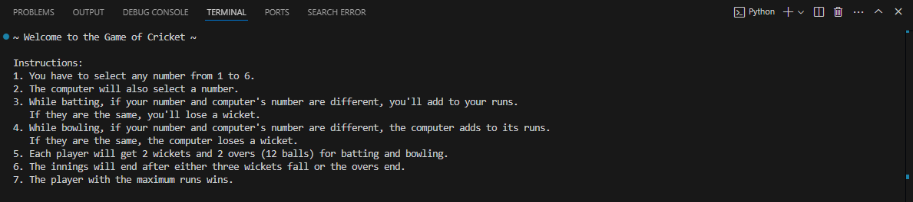

<h1>
  Circket-Game
</h1>
<h4>
  summary 
</h4>

  I developed an interactive cricket game in Python, designed to simulate the thrill of a cricket match. The game features a variety of functionalities, including team selection, toss decisions, and customizable match formats such as one-day internationals or T20s. Players can strategically choose their batting and bowling lineups, adding a layer of personalization to the gameplay.

The scoring mechanism dynamically tracks runs, wickets, and overs, while randomization algorithms ensure that each ball bowled results in a unique outcome, mimicking real-life unpredictability. Additionally, the game includes commentary for every delivery, providing a live-match feel. Users can view detailed scorecards at the end of each inning, including individual player performance and team statistics.

With its simple, text-based interface, the game prioritizes accessibility and ease of play. It leverages Python’s logical structures, such as loops and conditionals, and randomization to create a seamless experience. Whether for entertainment or as a programming project, this cricket game serves as a fun, engaging way to combine technology and sports.

|<h4>
  The instruction are shown in the fig:-
</h4>

